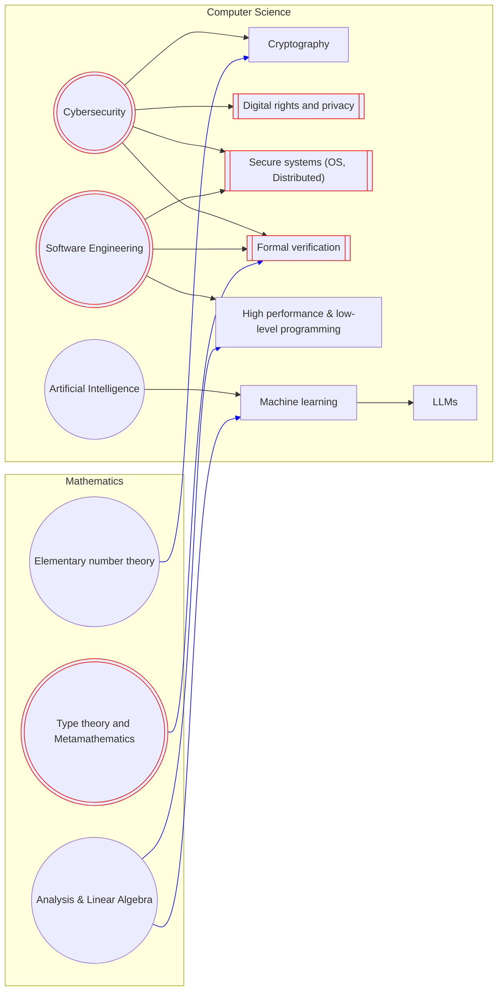

## Current status: MSc student (degree expected in Nov 2025).

## Looking for PhD opportunities
I am currently looking for full-time and fully-funded PhD openings that start
in 2026. If you are looking for PhD students, why not take a look at my
interests below?

If you are interested in working with me as my adviser/supervisor, I would be
very happy to [hear about it](#reach-me).

# Interests and areas of work
## Short summary
Powerful entities have long insisted on invading people's digital rights to an unjust degree 
(e.g. EU's chat control), despite explicit opposition from leading experts 
(e.g. Keys under doormats, bugs in our pockets).

My current interests are in these four directions:
1) Systematically or empirically (mainly computationally) analyze existing digitial (particularly network) systems
and figure out how and to what extent they enable such digital abuses.
2) Patch theses systems by engineering, or develop new systems if necessary.
3) Apply "paradoxical" modern cryptography constructs to achieve strong properties of developed systems.
4) Formalize and verify critical parts of our systems, or do it to other people's systems for the sake of 1).

I also have interests in theoretical areas:
1) type theory
2) metamathematics
3) theory of computation

But I self-estimate that I do not have the necessary knowledge base to work on
meaning things on them right away (I was not from a math major). As such, I
plan to accumulate my understanding of them while working on my current
interests, and explore them once I have enough knowledge.

To see an elaboration of my interests, please contact me. For reasons I cannot control, I must not publish
it publicly.

## Interets diagram
The chart below shows the areas that I currently have an interest in and work on.
- Those in circles are general directions, while those in rectangles are specific sub-topics.
- Those that I primarily focus on are in red and have double borders, while all the others that I just get in contact with are in dark blue.
- One topic derives (contains) another with an arrow. The arrows in the CS area are in black, whereas those in the Math area are in blue.
- I tried many ways to place the Mathematics subgraph to the right but none worked. Thus, the current lines are a bit messy.

## Previous interests
- Computer graphics
- Video games design, and human-computer interaction

# Reach me
## Email addresses
For now, I usually use guanyuminghe AT proton DOT me as my primary email
address. If you are in the academia, then I might also use one of my
institution email addresses. The current one is guanyuming DOT he 24 AT 
imperial DOT ac DOT uk.

Please note that I have no intention to use any of the email addresses
permanently. The proton one is subject to change, should I find Proton unethical
and untrustworthy in the future (see the suspension of journalists' email
addresses [by Proton](https://web.archive.org/web/20250923025829/https://theintercept.com/2025/09/12/proton-mail-journalist-accounts-suspended/)). 
My institution addresses are inherently temporary unless I obtain a permanent 
position in one someday.

## My PGP key
You may find my OpenPGP public key published
[here](https://github.com/guanyuming-he/Openpgp-key) useful.  I don't know
which email address I will use in the future, but you can always (until 2035,
to be cautious) trust the signatures made by my private key, if you know me and
you are confident that this GitHub account is controlled by myself (of course,
you have to trust your browser and the certificate authorities; be mindful to
detail in security).

## Instant messaging
One significant weakness of using OpenPGP keys to encrypt emails is the lack of
forward secrecy. It is technically possible for two parties to perform a 
Diffie-Hellman-like protocol via email to establish session keys, but that would
be extremely cumbersome, compared with automatic processes employed by instant
messaging programs.

To avoid having to trust a server, I only plan to use one
Instant Messaging protocol, Tox, for now. My Tox ID:
BF011A0BF6AAB23526445921291C601DAA63D808BC13F8D3EC8164448007AD5276D5589D6A82
(Check the Tox protocol specification to understand it https://toktok.ltd/spec)

On the other hand, email communication encourages one to think about the
message one's drafting before sending it, as there's no way to retract it back. 
Additionally, there's much less of the expectation for instant reply in email
communication. As such, I would select the communication method by use case.

# My repositories here
## Distribution
Most of my personal projects are here. Some other personal projects could
be belong to my other GitHub accounts, for example, the one I used during
my MSc, which was created to follow the recommendation of the department.
For your convenience, I have negotiated to publish some of those under 
other accounts of mine here. 

I also made an organization that you can find on my homepage to contain 
some of my group projects during my undergraduate study.

## Don't trust my activity panel
The activity algorithm is biased. First, it won't count commits to 
non-default branches. I could be using many different branches heavily 
sometimes. For instance, in some lab solutions I use a dedicated branch
for one lab by design. Second, repos authored by my other accounts that
I make public here also do not count.
