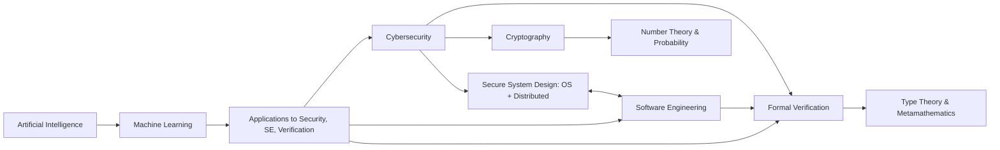

## Current status: MSc student.

## My PGP key
You may find my OpenPGP public key published [here](https://github.com/guanyuming-he/Openpgp-key) useful. 
I don't know which email address I will use in the future, but you can always (in the next 10 years, to be cautious) trust the signatures made by my private key,
if you know me and you are confident that this GitHub account is controlled by myself (of course, you have to trust your browser and the certificate authorities; be mindful to detail in security).

## Current Interests

## Previous Interests
- Computer graphics
- Video games design, and human-computer interaction

## Don't trust GitHub activity panel
The activity algorithm is biased. First, it won't count commits to non-default branches. 
Second, private repos from my university GitHub account that I make public here also do not count, 
because the author is that account of mine.
